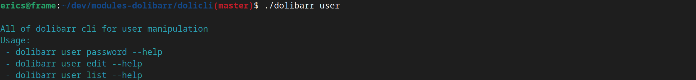
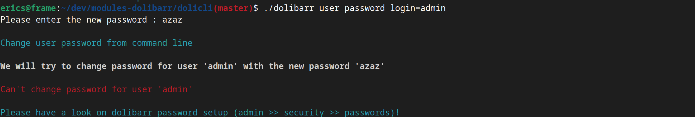
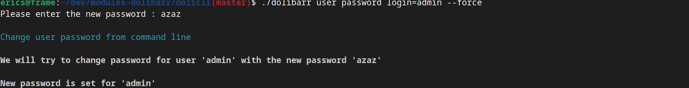

# Dolibarr from CLI

Dolibarr from command line

Set the path where your dolibarr is installed

```
DOLPATH=/var/www/dolibarr-18.0.7/htdocs/
```

Note you could use "export" to set your env var like

```
DOLPATH=/var/www/dolibarr-18.0.7/htdocs/
```


## Get users data

```
DOLPATH=/var/www/dolibarr-18.0.7/htdocs/ ./dolibarr users
```

if DOLPATH is exported

```
./dolibarr users
```



```
./dolibarr users password login=admin
```




Force change password will disable all dolibarr rules

```
./dolibarr users password login=admin --force
```


